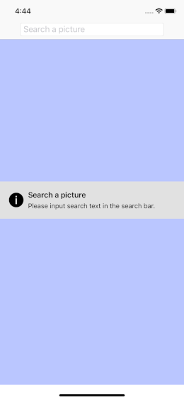
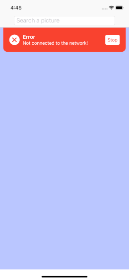

# MVVM and NetWorking with RxSwift
In this tutorial, I will implement the networking request in RxSwift, fetch the picture from the Flickr API, process the JSON data and bind the picture to the UI. The topics will be covered include:
- Networking with RxSwift
- JSON data parsing with Swift 4 Codable.
- Implement MVVM design pattern
- Unit test with RxTest

## Project setup 
Launch Xcode 10 and Create a new project by choosing the Single View Application and name it as RxNetWorking. Set Language to Swift and devices to iPhone. Check Include Unit Tests and keep both Core Data and Include UI Tests unchecked. Now within the project navigator, you can see the RxNetWorking Target and RxNetWorkingTests Target. Be sure to make the iOS Deployment Target and Swift Language Version in the Building Settings for both the project target and the tests target the same. 
In the project navigator, choose the folder of RxNetWorking. In the Info.plist, add App Transport Security Settings and its subitem Allow Arbitrary Loads and set the value to YES.
#### Integrate the third libraries
The third libraries will be used include: 
#### RxSwift and RxCocoa
This is the language will be used for this project. For more information, refer to  [ReactiveX/RxSwift](https://github.com/ReactiveX/RxSwift)
#### RxTest and RxBlocking
This will be used for test. For more information, refer to  [ReactiveX/RxSwift](https://github.com/ReactiveX/RxSwift)
#### ReachabilitySwift
It will be used to detect if the network is reachable.
#### SwiftMessages
It will be used to display messages to the users.

I am going to use CocoaPods to install these third library. If not familiar with CocoaPods, refer to [CocoaPods](https://cocoapods.org). In the terminal, under the project, create a [podfile](https://github.com/JunDang/RxNetWorking/blob/master/podfile) and install the podfile. At the same time, create a [.gitignore](https://github.com/JunDang/RxNetWorking/blob/master/.gitignore) so that we can ignore some files when push the project up to the GitHub.
## Implement  the MVVM design pattern
MVVM design pattern has many advantages over MVC pattern and many articles have described these detailedly. For example, refer to this article from [MVVM Tutorial](https://www.raywenderlich.com/34-design-patterns-by-tutorials-mvvm).
So in this tutorial, I will mainly focus on how to implement the project by following the MVVM design pattern. Now let’s work with the model layer.
### Model 
Open the RxNetWorking.xcworkspace file, under the RxNetWorking, create a new group named Model, and within the Model group, create a new swift file named FlickrPhotos.swift. Click to open the swift file. 
To fetch a photo, we firstly send a request to the Flickr API and obtain a list of image URLs. Then via the image URLs, we obtain the images. Let’s take a look at the JSON response from the Flickr API. The JSON has a root element “photos”. Inside “photos”, there is a next level root element “photo” which is an array of photos, as shown below. 
```
{
"photos": {
"page": 1,
"pages": 10,
"perpage": 25,
"total": "246",
"photo": [
{
"id": "21582914405",
"owner": "42922649@N00",
"secret": "3c4875cc7e",
"server": "683",
"farm": 1,
"title": "Stand Tall",
"ispublic": 1,
"isfriend": 0,
"isfamily": 0
},
{
"id": "21530307402",
"owner": "43246590@N06",
"secret": "d644667c02",
"server": "5694",
"farm": 6,
"title": "Sunflowers before the storm",
"ispublic": 1,
"isfriend": 0,
"isfamily": 0
},
{
"id": "18879744526",
"owner": "20286982@N07",
"secret": "696139cdbe",
"server": "5511",
"farm": 6,
"title": "Golden Plains",
"ispublic": 1,
"isfriend": 0,
"isfamily": 0
}
]
},
"stat": "ok"
}
```
 Here is the [Model](https://github.com/JunDang/RxNetWorking/blob/master/RxNetWorking/Model/FlickrPhotos.swift).
 Firstly create a struct named FlickrPhoto to represent the single photo and let it conform to the Codable protocol. We need the variables of farm, server, id and secret to construct the image url.  Let’s put these variables in the struct, and write the corresponding CodingKeys so that the items can be found when being decoded.  Then implement the init(farm: Int, id: String, server: String, secrect: String) and  init(from decoder: Decoder) methods. We also need construct the image URL with those parameters. So let’s implement the function creatImageURL() which has a return type of NSURL. 
 Secondly, create a struct named FlickrPhotos to hold the array of FlickrPhoto and let it conform to the Codable protocol. The CodingKey for finding the item is “photo”.   
 Finally, move to the root element “photos”and create a struct named FlickrModel which holds FlickrPhotos. And the key for finding this element is “photos”. 
 ### Networking
 Create a new group named Services under the RxNetWorking. Create a new swift file under this group and name it as InternetService. Import RxSwift and RxCocoa. Create an enumeration Result<T, Error> as the generic return type of networking request, see below. For the networking request from REST APIs, I choose to use the Apples’s URLSession because it is powerful and always updated simultaneously with the newest Swift versions. Now, let’s make URLSession reactive. Write a class InternetService, then write a static private function request which takes two parameters: a string of base url from the REST APIs and a dictionary of parameters which wii be the url components. And the function will return an Observable of Result<Data, Error>.  The function is implemented as below:
```
static private func request(_ baseURL: String = "", parameters: [String: String] = [:]) -> Observable<Result<Data, Error>> {
    //1
    let defaultSession = URLSession(configuration: .default)
    var dataTask: URLSessionDataTask?
    //2
    return Observable.create { observer in
    var components = URLComponents(string: baseURL)!
    components.queryItems = parameters.map(URLQueryItem.init)
    let url = components.url!
    var result: Result<Data, Error>?
    dataTask = defaultSession.dataTask(with: url) { data, response, error in
        if let data = data, let response = response as? HTTPURLResponse,  response.statusCode == 200 {
           result = Result<Data, Error>.Success(data)
        } else {
           if let error = error {
           result = Result<Data, Error>.Failure(error)
           }
        }
    observer.onNext(result!)
    observer.onCompleted()
    }
    dataTask?.resume()
    //3
    return Disposables.create {
       dataTask?.cancel()
    }
  }
}
```
Here is the explanation of the code:
1. Initialize a URLSession with default session configuration and declare a URLSessionDataTask variable for HTTP GET request. As this request function will be used for multiple API requests in this project, a new URLSession needs to be initialized for every API call.
2. This block wrap the URLSession in RxSwfit, create the Observable, construct the url from the baseURL and parameters, handle the Success case and Failure case, return the Observable of Result<Data, Error>, and      dispose the data task if it already exists.

For sending the network request to the Flickr API, here is the consideration. Firstly, I will need a cache system to store the image data. If the image data can be found in the cache, then I update the background with the cached image data. If there is no data cached, then I will send the request to the Flickr API to fetch the data. For saving the space, I will cache the image data instead of image itself into the cache. 

Let’s create a struct FlickrAPI as  [FlickrAPI](https://github.com/JunDang/RxNetWorking/blob/master/RxNetWorking/Services/InternetService.swift), which has the base url string, the API Key and search method. And also create an enum FlickrRequestError as  [FlickrRequestError](https://github.com/JunDang/RxNetWorking/blob/master/RxNetWorking/Services/InternetService.swift) which lists the error case of network request to Flickr API. 
- Protocols
Create a new group named Protocols under the RxNetWorking. Then create a new swift file named  ImageDataCachingProtocol, as [ImageDataCachingProtocol](https://github.com/JunDang/RxNetWorking/blob/master/RxNetWorking/Protocols/ImageDataCachingProtocol.swift). I will use the NSCache for the cache system, so implement the protocol’s methods as below:
```
class ImageDataCaching: ImageDataCachingProtocol {
    //1
    static var imageDataCache = NSCache<AnyObject, AnyObject>()
    //2
    static func saveImageDataToCache(data: NSData?, url: NSURL) {
       if let data = data {
       imageDataCache.setObject(data, forKey: url)
       }
    }
    //3
   static func imageDataFromURLFromChache(url: NSURL) -> NSData? {
      return imageDataCache.object(forKey: url) as? NSData
   }

}
```
Here is the explanation of the code:
1. Create a variable of NSCache.
2. Use the url of the image as the key and save the image data to the cache. 
3. Retrieve the image data from the cache.

Create a new swift file named InternetServiceProtocol as [InternetServiceProtocol](https://github.com/JunDang/RxNetWorking/blob/master/RxNetWorking/Protocols/InternetServiceProtocol.swift). Make the InternetService conform to the InternetServiceProtocol and implement the three protocol methods. 
Let’s implement the searchImageURL function to find the image url according to the search text:
```
static func searchImageURL(searchText: String) -> Observable<Result<NSURL, Error>> {
    //1
    let baseURLString = FlickrAPI.baseURLString
    let parameters = [
        "method": FlickrAPI.searchMethod,
        "api_key": FlickrAPI.apiKey,
        "format": "json",
        "nojsoncallback": "1",
        "per_page": "25",
        "text": "\(searchText)",
        "group_id": "1463451@N25",
        "tagmode": "all"
    ]
    //2
    return request(baseURLString, parameters: parameters)
        .map({ result in
            switch result {
            case .Success(let data):
            //3
            var flickrModel: FlickrModel?
            do {
               flickrModel = try JSONDecoder().decode(FlickrModel.self, from: data)
            } catch let parseError {
               return Result<NSURL, Error>.Failure(parseError)
            }
            let flickrPhotos = flickrModel!.flickrModel!.flickrPhotos
            //4
            guard flickrPhotos.count > 0 else {
               return Result<NSURL, Error>.Failure(FlickrRequestError.emptyAlbum)
            }
            //5
            let randomIndex = Int(arc4random_uniform(UInt32(flickrPhotos.count)))
            let photo = flickrPhotos[randomIndex]
            let imageURL = photo.createImageURL()
            return Result<NSURL, Error>.Success(imageURL)
            case .Failure(let error):
               return Result<NSURL, Error>.Failure(error)
           }
        })
}
```
Here is the explanation of the code:
1. Obtain the base url string of Flickr from the FlickrAPI and create the dictionary of parameters.
2. Call the request function and handle both the Success and Failure case of the return result.
3. Decode the response data.
4. If the number of photos is less than 0, return the emptyAlbum case of FlickrRequestError.
5. Randomly choose a image in the photo array and obtain its image url.

Implement the sendRquest function as below:
```
static func sendRequest(resultNSURL: Result<NSURL, Error>) -> Observable<Result<Data, Error>> {
    switch resultNSURL {
    //1
    case .Success(let imageURL):
       let baseURLString = imageURL.absoluteString
       let parameters: [String: String] = [:]
       var imageData: Data?
       return request(baseURLString!, parameters: parameters)
          .map({ result in
              switch result {
              //2
              case .Success(let data):
                 if data.count < 6000 {
                    imageData = UIImage(named: "banff")!.pngData()
                 } else {
                    imageData = data
                 }
              return Result<Data, Error>.Success(imageData!)
              //3
             case .Failure(let error):
                return Result<Data, Error>.Failure(error)
             }
          })
     case .Failure(let error):
        return Observable.just(Result<Data, Error>.Failure(error))
    }
}
```
Here is the explanation of the code:
1. In the Success case, send the network request by calling the function request.  
2. In the case of Success for the request and if the data size is less than 6000, we return a default image data, otherwise, we return the data. 
3. Handle the failure case. 

Implement the getImage function as below:
```
static func getImage(resultNSURL: Result<NSURL, Error>, cache: ImageDataCachingProtocol.Type) -> Observable<Result<UIImage, Error>> {
   switch resultNSURL {
      case .Success(let imageURL):
      //1
         if let imageDataFromCache = cache.imageDataFromURLFromChache(url: imageURL) {
            let imageFromCache = UIImage(data: imageDataFromCache as Data)
            return Observable.just(Result<UIImage, Error>.Success(imageFromCache!))
         } else {
            //2
            return self.sendRequest(resultNSURL:resultNSURL)
               .map() {(imageDataResult) in
                  switch imageDataResult {
                     case .Success(let imageData):
                        cache.saveImageDataToCache(data: imageData as NSData, url: imageURL)
                        let imageFromRequest = UIImage(data: imageData as Data)
                        return Result<UIImage, Error>.Success(imageFromRequest!)
                     case .Failure(let error):
                        return Result<UIImage, Error>.Failure(error)
                  }
              }
         }  
     //3
    case .Failure(let error):
       return Observable.just(Result<UIImage, Error>.Failure(error))
    }
}
```
Here is the explanation of the code:
1. In the Success case, if the image data can be found in the cache, return the Observable of the image.
2. In the Success case, if the image data can not be found in the cache, send the request to the network via the function of sendRequest and handle the Success and Failure case respectively.
3. Handle the failure case. 
### View Model
Create a new group named ViewModel under the RxNetWorking. Then create a new swift file named ViewModel.
Write a class ViewModel, and we need a input which will be the searchText variable transffered from the View Controller which will be implemented later on. We also need an output, the flickrImageObservable,  which will be the result of the communicating between the view model and the model. This output will be transferred to the view controller. Now implement the ViewModel class as  [ViewModel](https://github.com/JunDang/RxNetWorking/blob/master/RxNetWorking/ViewModel/ViewModel.swift).
Here is the explanation of the code:
1. Search the image url and get the image.
2. In the case of Success, return the image. In the case of Failure, return a default image.
### View Controller
Now it is time to implement the UI. The UI is  a very simple one since the major purpose of this project is to demonstrate the MVVM and network request in RxSwift. Create a new group View Controller and create a new swift file FlickrViewController. Write a class FlickrViewController. Open the main story board, set the View Controller to FlickrViewController and embed it in a navigation controller. Drag a UIImageView to the FlickrViewController and make it to cover the FlickrViewController UIView completely via setting the constrains, see below picture.  Then drag a text field to the navigation bar, input Search a picture in the placeholder. Then drag from the UIImageView and TextField to the class FlickrViewController to create outlet variables of backgroundImageView and searchTextField respectively.

I have installed Reachability for detecting the network access status. Now, create a new swift file RxReachability+rx, which I updated  the  [RxReachability](https://github.com/bmoliveira/RxReachability).

In the class FlickrViewController, declare a variable of Reachability, SwiftMessages, and DisposeBag respectively. Override the function viewDidLoad, implement the code as below:
```
override func viewDidLoad() {
    super.viewDidLoad()
    //1
    reachability = Reachability()
    try? reachability?.startNotifier()
    //2
    let activityIndicator = UIActivityIndicatorView(style: .whiteLarge)
    backgroundImageView.addSubview(activityIndicator)
    activityIndicator.frame = self.backgroundImageView.bounds
    //3
    searchTextField.rx.controlEvent(.editingDidEndOnExit).asObservable()
      .map { self.searchTextField.text }
      .filter { ($0 ?? "").count > 0 }
      .flatMap() {text -> Observable<UIImage> in
          activityIndicator.startAnimating()
          return ViewModel(searchText: text ?? "", apiType:  InternetService.self).flickrImageObservable
      }
     .asDriver(onErrorJustReturn: UIImage(named: "banff")!)
     .drive(onNext: { [weak self] flickrImage in
         let resizedImage = flickrImage.scaled(CGSize(width:   (self?.backgroundImageView.frame.width)!, height: (self?.backgroundImageView.frame.height)!))
         self?.backgroundImageView.image = resizedImage
        activityIndicator.stopAnimating()
     })
    .disposed(by: bag)
}
```
Here is the explanation of the code:
1. Set up the reachability and its notifier
2. Add activity indicator view
3. Search the Flickr image with the input text by communicating with the view model, resize the image to the backgroundImageView size, and bind the image to the background. 

Override the function viewWillApear, and display the message, implement the code as below:
```
override func viewWillAppear(_ animated: Bool) {
    super.viewWillAppear(animated)
    //1
    Reachability.rx.isDisconnected
        .subscribe(onNext:{
           let error = MessageView.viewFromNib(layout: .tabView)
           error.configureTheme(.error)
           error.configureContent(title: "Error", body: "Not connected to the network!")
           error.button?.setTitle("Stop", for: .normal)
           SwiftMessages.show(view: error)
        })
        .disposed(by:bag)
}
```
Here is the explanation of the code:
1. If the net work is not connected, display the message.
Override the function viewDidApear, use MessageView to display “Please input search text in the search bar”. 

Build the project. Type a text in the search bar and the image is loaded. 





### Unit Test
Open the folder RxNetWorkTests, create new group Mocks. Under Mocks, create a new swift file MockInternetService and write a class MockInternetService and let it conform to InternetServiceProtocol. 
```
class MockInternetService: InternetServiceProtocol {
     //1
     static var imageURLResult = PublishSubject<Result<NSURL, Error>>()
     static var imageDataResult = PublishSubject<Result<Data, Error>>()
     static var imageResult = PublishSubject<Result<UIImage, Error>>()
     //2
     static func searchImageURL(searchText: String) -> Observable<Result<NSURL, Error>> {
         return imageURLResult.asObservable()
     }
     //3
     static func sendRequest(resultNSURL: Result<NSURL, Error>) -> Observable<Result<Data, Error>> {
       return imageDataResult.asObservable()
     }
     //4
     static func getImage(resultNSURL: Result<NSURL, Error>, cache: ImageDataCachingProtocol.Type) -> Observable<Result<UIImage, Error>> {
         switch resultNSURL {
         case .Success:
             return self.sendRequest(resultNSURL:resultNSURL)
                .map() {(imageDataResult) in
                    switch imageDataResult {
                    case .Success(let imageData):
                       let imageFromRequest = UIImage(data: imageData as Data)
                       return Result<UIImage, Error>.Success(imageFromRequest!)
                    case .Failure(let error):
                       return Result<UIImage, Error>.Failure(error)
                   }
           }
        case .Failure(let error):
            return Observable.just(Result<UIImage, Error>.Failure(error))
        }
   }
}
```
Here is the explanation of the code:
1. Declare 3 static variables PublishSubject<Result<NSURL, Error>>, PublishSubject<Result<Data, Error>>, PublishSubject<Result<UIImage, Error>>. The reason why them as PublishSubject is because they will be used as Observables which will be the return results of the protocol, and also as Observers which emit test values. 
2. Implement function searchImageURL and return the Observable of imageURLResult.
3. Implement function sendRequest and return the Observable of imageDataResult.
4. Implement function getImage and return the Observable of imageResult.

Create a new swift file TestData and implement  the class [TestData](https://github.com/JunDang/RxNetWorking/blob/master/RxNetWorkingTests/Mocks/TestData.swift) which will be used as the test data and test objects. 

Create a new swift file ViewModelTest and implement the class ViewModeTest as below:
```
class ViewModelTests: XCTestCase {
    let bag = DisposeBag()
    //1
    private func createViewModel(text: String) -> ViewModel {
        return ViewModel(searchText: text, apiType: MockInternetService.self, imageDataCacheType: ImageDataCaching.self)
    }
    //2
    func test_whenInitialized_storesInitParams() {
        let text = "toronto"
        let viewModel = createViewModel(text: text)

        XCTAssertNotNil(viewModel.searchText)
        XCTAssertNotNil(viewModel.apiType)
        XCTAssertNotNil(viewModel.imageDataCacheType)
    }
   //3
   func test_whenInit_callsBindToOutPut_FetchImage() {
       let text = "toronto"
       let viewModel = createViewModel(text: text)
       let flickrImageObservable = viewModel.flickrImageObservable

       DispatchQueue.main.async {
           MockInternetService.imageURLResult.onNext(Result<NSURL, Error>.Success(TestData.stubImageURL!))
           MockInternetService.imageDataResult.onNext(Result<Data, Error>.Success(TestData.stubFlickrImageData!))
       }

       let emitted = try! flickrImageObservable.take(1).toBlocking(timeout: 1).toArray()
       XCTAssertEqual(emitted[0].pngData(), TestData.stubFlickrImageData)
   }
}
```
Here is the explanation of the code:
1. Create the ViewModel with MockInternetService
2.  When the ViewModel initialized , the stored properties are not nil.
3.  When imageURLResult emit the stubImageURL of the TestData, and imageDataResult emit the stubFlickrImageData of the TestData, the first emitted value of flikcrImageObservable of the viewModel is equal to the expected value which is the stubFlickrImageData of the TestData.

So far we have completed this project, we have practiced the MVVM, network request to REST API,  and Unit Test written in RxSwift. The project can be found here [RxNetWorking](https://github.com/JunDang/RxNetWorking).
